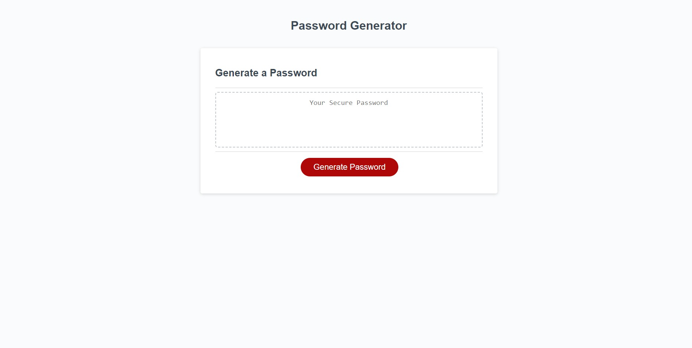

# Random Password Generator

This code takes user input through prompts and generates a corresponding randomized password that can contain lowercase, uppercase, numeric, and special characters. Prompts are repeated with appropriately changed messages when user inputs are invalid.

# Deployed Application Link

https://fy50167.github.io/random-password-generator/

# Deployed Application Screenshot

